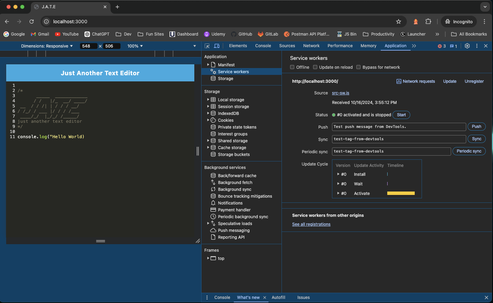

# J.A.T.E - JUST ANOTHER TEXT EDITOR


## Description
J.A.T.E is a progressive web application (P.W.A) text editor built using Node.js, Express.js and Workbox. The application can be installed and ran offline.

## Table of Contents
-[Description](#description)

-[User Story](#user-story)

-[Acceptance Criteria](#acceptance-criteria)

-[Installation](#installation)

-[Live Link](#live-link)

-[Usage](#usage)

-[Credits](#credits)

-[Tests](#tets)

-[Contact](#contact)


## User Story

```md
AS A developer
I WANT to create notes or code snippets with or without an internet connection
SO THAT I can reliably retrieve them for later use
```

## Acceptance Criteria

```md
GIVEN a text editor web application
WHEN I open my application in my editor
THEN I should see a client server folder structure
WHEN I run `npm run start` from the root directory
THEN I find that my application should start up the backend and serve the client
WHEN I run the text editor application from my terminal
THEN I find that my JavaScript files have been bundled using webpack
WHEN I run my webpack plugins
THEN I find that I have a generated HTML file, service worker, and a manifest file
WHEN I use next-gen JavaScript in my application
THEN I find that the text editor still functions in the browser without errors
WHEN I open the text editor
THEN I find that IndexedDB has immediately created a database storage
WHEN I enter content and subsequently click off of the DOM window
THEN I find that the content in the text editor has been saved with IndexedDB
WHEN I reopen the text editor after closing it
THEN I find that the content in the text editor has been retrieved from our IndexedDB
WHEN I click on the Install button
THEN I download my web application as an icon on my desktop
WHEN I load my web application
THEN I should have a registered service worker using workbox
WHEN I register a service worker
THEN I should have my static assets pre cached upon loading along with subsequent pages and static assets
WHEN I deploy to Render
THEN I should have proper build scripts for a webpack application
```


## Installation

- [Clone https://github.com/JMRobertson89/Social-Network-API](https://github.com/JMRobertson89/J.A.T.E-Just-Another-Text-Editor)
- Install packages with "npm install"
- Run 'npm run start' to start the application

## Live Link

- [Click here to view the application](https://j-a-t-e-1029.onrender.com/)

## Usage


The following image shows the application's `manifest.json` file:


The following image shows the application's registered service worker:



The following image shows the application's IndexedDB storage:


## Credits


## Tests

none

## Contact

[JMRobertson89](https://github.com/JMRobertson89)

Email Joshua Robertson at josh@jrobertson.io